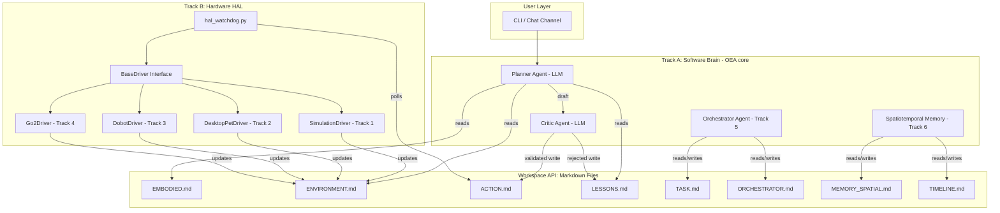

# OpenEmbodiedAgent — Developer Guide

> Version: 0.0.2 | Last Updated: 2026-03-15

## 1. Project Overview

OpenEmbodiedAgent (OEA) is a consumer-grade embodied AI framework that uses **Markdown files as the universal communication protocol** between an LLM-powered brain (Track A) and physical/simulated robot bodies (Track B).

The framework is built on top of [OEA](./README_OEA.md), an ultra-lightweight personal AI assistant, and extends it with embodied capabilities.

## 2. Architecture Diagram



## 3. Core Design Principles

### 3.1 Everything is Markdown
All inter-module communication happens through `.md` files in the workspace directory. No direct Python imports cross the Track A / Track B boundary.

### 3.2 Driver is Body
Each robot embodiment implements the `BaseDriver` abstract class. Drivers are loaded dynamically via `--driver` CLI parameter. A driver developer only touches files inside `hal/drivers/` and `hal/profiles/`.

### 3.3 Profile is Switch
Each robot body has an `EMBODIED.md` profile under `hal/profiles/`. When the watchdog starts with `--driver <name>`, it copies the matching profile to the workspace as `EMBODIED.md`.

### 3.4 OEA is Core
We do NOT fork OEA. We extend it by:
- Adding templates to `OEA/templates/`
- Adding tools to `OEA/agent/tools/`
- The agent context (`context.py`) loads all workspace `.md` files as bootstrap context

## 4. Development Tracks

Each track has its own detailed specification document:

| Track | Owner | Specification | Scope |
|-------|-------|--------------|-------|
| Track 1 | Simulation Arm | [track-1-simulation.md](track-1-simulation.md) | PyBullet sim + grasping |
| Track 2 | Desktop Pet | [track-2-desktop-pet.md](track-2-desktop-pet.md) | Physical desktop robot |
| Track 3 | Dobot ReKep | [track-3-dobot-rekep.md](track-3-dobot-rekep.md) | Dual-arm manipulation |
| Track 4 | Go2 Navigation | [track-4-go2-navigation.md](track-4-go2-navigation.md) | Quadruped navigation |
| Track 5 | Multi-Agent | [track-5-multi-agent.md](track-5-multi-agent.md) | Orchestrator agent |
| Track 6 | Memory | [track-6-spatiotemporal-memory.md](track-6-spatiotemporal-memory.md) | Spatiotemporal memory |
| Track 7 | Framework Core | [track-7-framework-core.md](track-7-framework-core.md) | BaseDriver + watchdog |

## 5. File Ownership Rules

```
Files you CAN modify         Files you MUST NOT modify
─────────────────────        ─────────────────────────
hal/drivers/YOUR_driver.py   OEA/agent/loop.py
hal/profiles/YOUR_body.md    OEA/agent/context.py
tests/test_YOUR_driver.py    hal/base_driver.py (Track 7 only)
                             hal/hal_watchdog.py (Track 7 only)
                             Other people's drivers
```

## 6. Getting Started

```bash
# Clone and install
git clone <repo-url>
cd OpenEmbodiedAgent
pip install -e .

# Run with simulation driver (default)
python hal/hal_watchdog.py --driver simulation

# In another terminal, start the brain
OEA agent
```

## 7. Testing Contract

Every driver MUST pass the base driver contract test:

```bash
pytest tests/test_hal_base_driver.py --driver YOUR_DRIVER_NAME
```

This verifies that your driver correctly implements `load_scene()`, `execute_action()`, `get_scene()`, and `get_profile_path()`.

## 8. Markdown Protocol Specification

### ACTION.md Format
```json
{
  "action_type": "pick_up",
  "parameters": {"target": "red_apple"},
  "status": "pending"
}
```

Semantic navigation actions use the same fenced JSON shape:

```json
{
  "action_type": "semantic_navigate",
  "parameters": {
    "robot_id": "go2_edu_001",
    "target_ref": {"kind": "node", "id": "furniture_fridge", "label": "fridge"},
    "goal_pose": {"frame": "map", "x": 2.1, "y": 0.8, "yaw": 1.57},
    "approach_distance": 0.5,
    "timeout_s": 120
  },
  "status": "pending"
}
```

### ENVIRONMENT.md Format
```json
{
  "red_apple": {
    "type": "fruit",
    "position": {"x": 5, "y": 5, "z": 0},
    "location": "table"
  }
}
```

Structured `oea.environment.v1` documents may also include:

- `scene_graph` for semantic nodes and relations
- `robots.<robot_id>.robot_pose` for localization state
- `robots.<robot_id>.nav_state` for navigation task state
- `map` for global occupancy-map metadata and semantic zones
- `tf` for summarized transform availability

All JSON is wrapped in fenced code blocks inside the Markdown file.

---

# 中文版：OpenEmbodiedAgent 开发者指南

> 版本: 0.0.2 | 最后更新: 2026-03-15

## 1. 项目概述

OpenEmbodiedAgent (OEA) 是一个消费级具身智能框架，使用 **Markdown 文件作为通用通信协议**，连接 LLM 驱动的软件大脑 (Track A) 和物理/仿真机器人本体 (Track B)。

框架基于 [nanobot](../README_nanobot.md)（超轻量个人 AI 助手）构建，并在此基础上扩展了具身能力。

## 2. 架构图

（同英文版 Mermaid 图，此处省略重复）

## 3. 核心设计原则

### 3.1 万物皆 Markdown
所有跨模块通信都通过工作区 (`workspace`) 目录下的 `.md` 文件完成。Track A 和 Track B 之间没有直接的 Python import 调用。

### 3.2 Driver 即本体
每种机器人硬件实现 `BaseDriver` 抽象类。驱动通过 `--driver` CLI 参数动态加载。驱动开发者只需修改 `hal/drivers/` 和 `hal/profiles/` 中的文件。

### 3.3 Profile 即切换
每种机器人本体在 `hal/profiles/` 下有一个 `EMBODIED.md` 档案。当看门狗 (`hal_watchdog.py`) 以 `--driver <名称>` 启动时，会自动将对应档案复制到工作区作为 `EMBODIED.md`。

### 3.4 nanobot 是核心
我们**不 fork nanobot**，而是通过以下方式扩展它：
- 向 `nanobot/templates/` 添加模板
- 向 `nanobot/agent/tools/` 添加工具
- Agent 上下文 (`context.py`) 自动加载工作区中所有 `.md` 文件作为引导上下文

## 4. 开发轨道

每个轨道有独立的详细规格文档：

| 轨道 | 负责人 | 规格文档 | 范围 |
|------|--------|---------|------|
| Track 1 | 仿真机械臂 | [track-1-simulation.md](track-1-simulation.md) | PyBullet 仿真 + 抓取 |
| Track 2 | 桌面宠物 | [track-2-desktop-pet.md](track-2-desktop-pet.md) | 物理桌面机器人 |
| Track 3 | 越疆 ReKep | [track-3-dobot-rekep.md](track-3-dobot-rekep.md) | 双臂操作 |
| Track 4 | Go2 导航 | [track-4-go2-navigation.md](track-4-go2-navigation.md) | 四足导航 |
| Track 5 | 多智能体 | [track-5-multi-agent.md](track-5-multi-agent.md) | 中控调度 Agent |
| Track 6 | 记忆系统 | [track-6-spatiotemporal-memory.md](track-6-spatiotemporal-memory.md) | 时空记忆 |
| Track 7 | 框架核心 | [track-7-framework-core.md](track-7-framework-core.md) | BaseDriver + 看门狗 |

## 5. 文件归属规则

```
你可以修改的文件                你不能修改的文件
─────────────────────          ─────────────────────────
hal/drivers/你的_driver.py     nanobot/agent/loop.py
hal/profiles/你的本体.md        nanobot/agent/context.py
tests/test_你的_driver.py      hal/base_driver.py (仅 Track 7)
                               hal/hal_watchdog.py (仅 Track 7)
                               其他人的 driver
```

## 6. 快速开始

```bash
# 克隆并安装
git clone <repo-url>
cd OpenEmbodiedAgent
pip install -e .

# 使用仿真驱动运行 (默认)
python hal/hal_watchdog.py --driver simulation

# 在另一个终端启动大脑
nanobot agent
```

## 7. 测试合约

每个 Driver 必须通过基础驱动合约测试：

```bash
pytest tests/test_hal_base_driver.py --driver 你的驱动名称
```

这会验证你的 Driver 是否正确实现了 `load_scene()`、`execute_action()`、`get_scene()` 和 `get_profile_path()`。

## 8. Markdown 协议规范

### ACTION.md 格式
```json
{
  "action_type": "pick_up",
  "parameters": {"target": "red_apple"},
  "status": "pending"
}
```
由 Critic Agent 校验通过后写入。HAL Watchdog 轮询并执行后清空。

### ENVIRONMENT.md 格式
```json
{
  "red_apple": {
    "type": "fruit",
    "position": {"x": 5, "y": 5, "z": 0},
    "location": "table"
  }
}
```
由 HAL Watchdog 在每次动作执行后更新。Planner Agent 在规划前读取。

所有 JSON 都包裹在 Markdown 的代码围栏块中。
